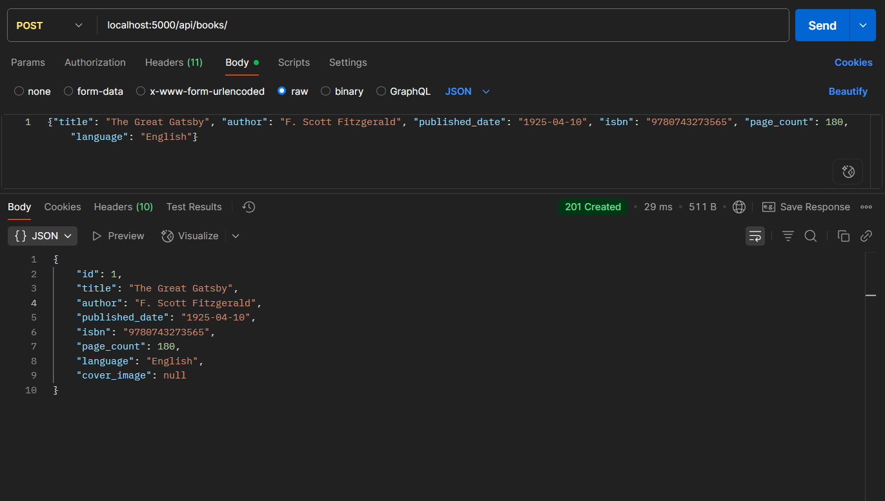
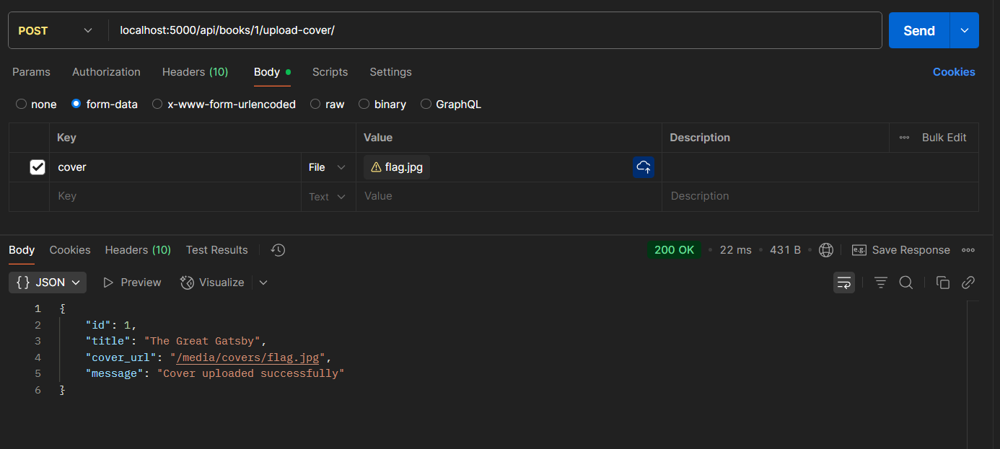
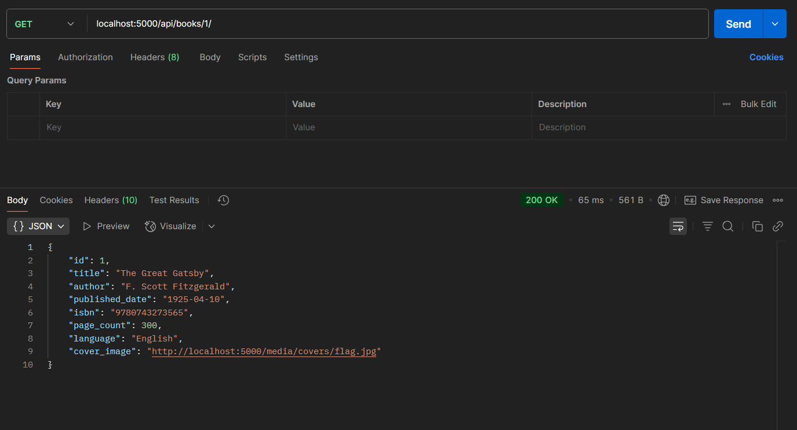
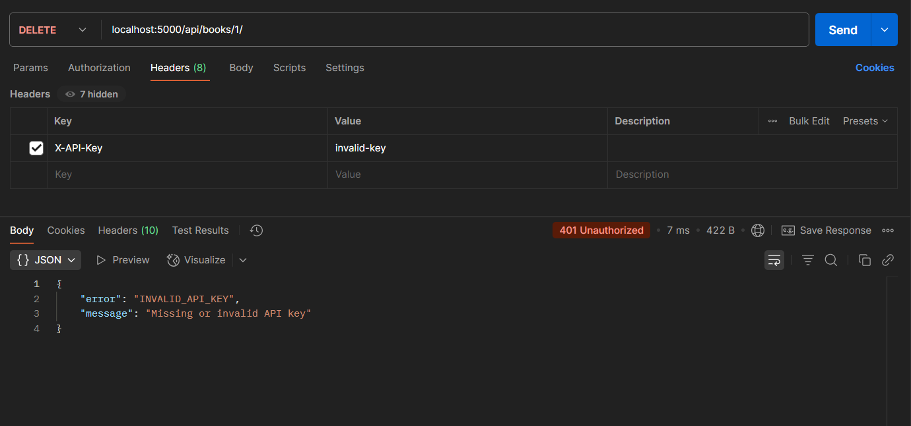
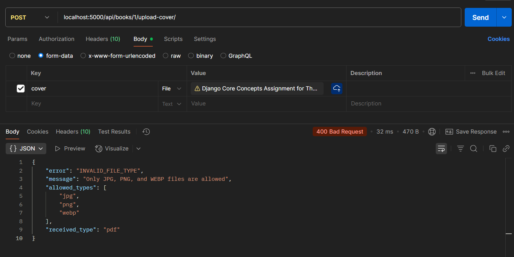

# 📚 Django Book Catalog API

A RESTful API for managing a book catalog system with authentication, file uploads, and Postman test support.

---

## 🚀 Setup Instructions

1. **Clone the repo:**
   ```bash
   git clone https://github.com/yourusername/django-book-catalog-api.git
   cd django-book-catalog-api
   ```
2. **Start Python Virtual Enviorment:**
   ```bash
   python -m venv venv
   source venv/bin/activate  # or venv\Scripts\activate on Windows
   ```
3. **Install Dependencies:**
   ```bash
   pip install -r requirements.txt
   ```
4. **Run Migrations:**
   ```bash
   python manage.py makemigrations
   python manage.py migrate
   ```
5. **Start Development Server:**
   ```bash
   python manage.py runserver
   ```

## 🔐 API Key Authentication

### Configuration in your .env file:

VALID_API_KEYS=valid-key

In settings.py, it will read:

VALID_API_KEYS = env("VALID_API_KEYS", default="valid-key").split(",")

### 📬 How to Use:

Send this header in Postman:

Key:   X-API-Key
Value: valid-key

## 📸 Screenshots of 5 Key Postman Tests

### 1️⃣ Create Book (Valid Data)


### 2️⃣ Upload Valid Cover Image


### 3️⃣ Get Book with Cover


### 4️⃣ Invalid API Key Test


### 5️⃣ Invalid File Type (400)


